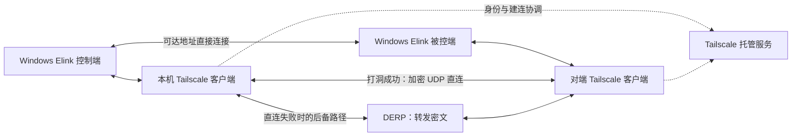

# Elink 重做调研：游戏串流与内置 P2P

调研日期：2026-09-14。

调研阶段状态：完成当时的代码静态检查、官方资料调研及本机 Tailscale 单端网络诊断。用户随后明确要求借鉴逻辑、不依赖 Sunshine/Moonlight 应用；0.3 已转向 Elink 自己的串流核心，详见 [实现记录](implementation.md)。下文保留历史调研与当时建议，其中复用两个应用的方案已被替代。双机游戏延迟、物理手柄和跨运营商穿透仍待实测。

## 1. 产品方向

用户已明确：游戏串流优先，重点是低延迟、高帧率和手柄。首版只考虑 Windows，后续考虑 Linux 和 Android；不考虑 macOS 或 iOS。

当前没有自有服务器，也不假设两端在同一局域网。以下按“两台设备各自能上网”理解；如果两端既没有互联网路径，也没有共享的本地网络，则任何远控方案都无法连接。用户接受在无法自行完成连接时对外依赖 Tailscale。

Elink 定位为游戏串流与远程桌面软件。性能与输入能力参考 Sunshine/Moonlight，连接操作参考 UU 远程。首版支持已可达地址的直接连接，并将外部 Tailscale 作为跨网连接方案；自建信令、中继和完全内置的穿透不作为首版交付前提。

建议的首版流程是：两端安装 Elink -> 选择直接可达地址，或先通过 Tailscale 加入同一个可互访的网络 -> 完成 Elink 配对授权 -> 进入游戏或桌面。Tailscale 连接成功不等于自动获得 Elink 控制权限。

Windows 首版同时考虑控制与被控角色，分别启用。后续 Linux 建议覆盖两种角色，Android 先做控制端；Android 被控尚未纳入实施方案。下文竞品事实中涉及的其他平台仅作背景记录，不属于 Elink 路线图。

## 2. Sunshine 与 Moonlight 的分工

| 组件 | 职责 | 对 Elink 的价值 |
| --- | --- | --- |
| Sunshine | 在游戏电脑上采集屏幕和音频、编码、发送串流、接收输入、启动应用 | 被控端的原生串流与系统适配基础 |
| Moonlight | 在客户端接收串流、解码、呈现画面、播放声音、采集键鼠和手柄输入 | 控制端的低延迟播放与输入基础 |
| moonlight-common-c | 多个 Moonlight 客户端共享的 GameStream 协议核心 | 可以复用的协议实现，但不包含完整的平台解码、渲染和 UI |

Sunshine 支持 AMD、Intel、NVIDIA 的硬件编码，也提供软件编码。Moonlight PC 官方说明列出 H.264、HEVC、AV1、硬件解码、HDR、7.1 音频、相对鼠标与桌面鼠标模式、手柄震动等能力。编码格式、HDR 和高帧率均取决于两端硬件、操作系统、驱动和实际版本，不能视为所有设备上的统一保证。[S1][S2]

它们的传输不是简单的“截图塞进一条 TCP”。源码将会话协商、控制、视频、音频、输入分为不同阶段和模块；视频/音频使用低延迟网络通路，控制与输入有各自的可靠性机制。Sunshine 还提供视频 FEC 配置，以额外带宽换取一定的丢包恢复能力。[S3][S4]

配对流程包括 Moonlight 发起配对、Sunshine 端确认 PIN、再启动应用。Elink 若复用引擎，需要把配对和设备信任整合进自己的界面，同时保留对端身份验证。[S5]

### 外网能力的实际边界

Sunshine 的 UPnP 功能用于尝试打开路由器上的串流端口。Moonlight 官方外网指南还介绍手动端口映射、IPv6，以及 Tailscale/ZeroTier 等额外组网工具。[S3][S5]

这不等于一个内置账号发现、NAT 打洞和高带宽中继的完整产品。UPnP 不能解决所有运营商 CGNAT、多层 NAT 或受限网络；IPv6 也仍受两端连通性和防火墙影响。

GameStream 使用多个 TCP/UDP 端口，部分连接参数通过会话协商获得。内置隧道必须覆盖完整会话、双向数据和端口关系，不能只转发一个视频端口。Elink 的设备发现也不能假设 mDNS 会穿过互联网或应用隧道。[S4][S5]

### 当前版本需要特别注意

- Sunshine 的稳定版和开发分支文档均将 macOS 被控标为实验性，并明确其被控端不支持手柄。此项仅保留为竞品事实，Elink 已排除该平台。[S6]
- 当前 Sunshine 文档已引入 Virtual HID Driver；完整驱动能力涉及机器授权，开发分支明确其为付费升级。ViGEmBus 是能力有限且已停止维护的后备方案。不能沿用旧教程，把现代手柄能力和驱动分发成本当作已经解决。[S6]
- 后续 Linux 捕获和输入取决于 X11/Wayland、桌面环境、Portal/KMS 等后端及权限，跨平台 UI 无法代替这些系统适配。[S1][S6]
- `moonlight-common-c` 明确依赖其特定 ENet 子模块版本，不能任意替换为系统中的普通 ENet。[S4]
- 旧版 Moonlight Wiki 的系统要求与当前 Sunshine README 存在版本差异。正式开发必须锁定一组可配套构建的版本、子模块和驱动；本次采样的开发分支提交只用于调研记录。[S1][S5]

## 3. UU 远程值得学习什么

官方页面可确认的产品能力包括：设备登录后在列表中连接、进入桌面、会话内控制中心、画质和声音设置、按键映射、手柄、远程协助，以及面向日常桌面的文件传输和多屏功能。[U1][U2]

官网当前宣传“4K 144 帧”；这是官方功能宣传，不是本次实测结果，也不表示任意网络、终端或所有画质选项都能同时达到。对于 Elink，应拆成能力协商和可测试的分辨率/帧率档位。[U1]

| 维度 | 官方资料可确认的情况 | 对 Elink 的启发 |
| --- | --- | --- |
| 连接体验 | 登录就绪后可从设备列表进入桌面 | 将地址发现、授权与网络协商收进产品流程 |
| 桌面被控 | 帮助页列出 Windows、macOS 被控 | 分开定义控制端与被控端支持矩阵 |
| 多端控制 | Windows/macOS/Android/iOS；官网另列 TV Beta | 移动端与电视端需要专门的输入和导航设计 |
| 手柄 | 支持常见手柄及震动，存在平台和系统版本限制 | 建立实体设备兼容表，不只实现按钮映射 |
| 高级手柄特性 | 本次查阅的帮助页注明陀螺仪、触摸板暂不支持 | 不把“支持手柄”理解为支持全部外设特性 |
| 远程协助 | ID 与验证码连接、一键禁止协助 | 自有设备绑定与临时授权应有不同流程 |

手柄帮助页还说明连接数量、第三方手柄的 Xbox 模式和震动的系统条件；因此验收需要覆盖按键、摇杆、扳机、震动、热插拔和多手柄，而不是只有一次按键成功。[U3]

本次查阅的公开材料没有提供足够信息来确认 UU 的底层传输协议、打洞算法、中继拓扑、真实直连成功率或完整加密设计。不能声称它使用了某个具体 WebRTC、QUIC 或自研协议。这里借鉴的是可观察的产品行为，不是对闭源内部实现的猜测。

## 4. “自带 P2P 内网穿透”需要哪些部分

P2P 的目标是让媒体尽量在两台设备之间直接传输。它不代表完全没有服务器，也无法保证在所有网络中打洞成功。

### 当前没有自有服务器时的可行性

| 网络条件 | 可行性 | 首版处理 |
| --- | --- | --- |
| 两端有可达的公网 IPv6，相关防火墙允许连接 | 可直接连接，无需租用服务器 | 保留直接地址连接；验证两端和完整串流端口 |
| 被控端有公网 IPv4，必要端口可映射或直接访问 | 可直接连接，无需额外服务器 | 保留直接连接；映射是用户网络的条件，不假设默认具备 |
| 两端在 NAT 后，使用公共 STUN 并手动交换 ICE 候选信息 | 部分网络可以打洞；公共 STUN 仍属于第三方服务 | 可作未来验证，缺少自动信令和中继，不作为稳定首版基础 |
| 两端在受限 NAT 后，无可用入站路径，也无外部协调/转发设施 | 无法保证完成发现、打洞及连通性兜底 | 接入外部 Tailscale；若仍无法直连，评估其实际中继性能 |
| 两端都没有互联网路径，也没有共享网络 | 无法连接 | 需要先建立网络路径 |

“没有自有服务器”与“完全不依赖任何外部服务器”是不同条件。手动交换地址/连接码可以替代部分信令，但连接码本身不会穿透防火墙，也不能替代失败时的中继。

Tailscale 官方当前文档区分 UDP 直连、DERP 中继和同一 tailnet 内其他设备提供的 Peer Relay。成功打洞后，媒体可通过两端的加密 UDP 通道直传；依赖 Tailscale 不意味着所有串流持续经过它的服务器。DERP 可辅助建连和在失败时转发，但无法保证游戏所需的延迟与吞吐。Peer Relay 需要额外可达设备，当前不假设已有。[N5]

首版优先使用 Windows 上安装的官方 Tailscale 客户端。它为完整的 TCP/UDP 串流协议提供系统网络路径，可以避免首版额外开发多端口应用隧道。Tailscale 的账号认证、设备加入、访问控制和外部服务可达性仍是前置条件。

### 本机网络诊断记录

2026-09-14 对本机已有 Tailscale 执行了只读状态检查和 `tailscale netcheck --format=json`，没有登录账号、改变路由、开放端口或调整防火墙。

| 项目 | 结果 | 能得出的结论 |
| --- | --- | --- |
| UDP、IPv4、IPv6 探测 | 均为 `true` | 本机具备对应的外部探测能力；不证明对端或入站服务可达 |
| `MappingVariesByDestIP` | `false` | 本次探测未发现随目标变化的映射，是打洞的有利条件，不能单独推出 NAT 类型或成功率 |
| UPnP / NAT-PMP / PCP | 均为 `false` | 本次未探测到可用端口映射能力 |
| Tailscale 服务 | 已安装且服务运行 | 无需重新安装即可继续排查配置状态 |
| Tailscale 后端 | `NoState`，提示正在启动；本机未在线 | 当前尚未进入可用于连接其他设备的状态，不能据此断言账号未登录 |

尚无第二端的网络诊断、可达地址和可用会话，因而没有完成双端直连判断或串流实测。这里的单端结果不能证明“必须依赖 Tailscale”，也不能证明“无需 Tailscale 就一定可连”。

### 未来完全内置穿透的组件

以下是后续自建或更深度集成时的职责分解，不是当前必须部署的服务清单。

| 部分 | 职责 | 是否承担持续音视频流量 |
| --- | --- | --- |
| 设备与信令服务 | 设备身份、授权、在线状态、候选地址和会话协商 | 直连时不承担媒体流量 |
| STUN / 连通性探测 | 发现外部地址，辅助验证可用路径 | 不转发完整媒体流 |
| P2P 通道 | LAN、可达 IPv6 或 NAT 打洞后的加密直连 | 两端直接收发 |
| 中继服务 | 直连不可用时转发加密数据 | 承担媒体带宽 |

若未来实施自有穿透组件，推荐并行收集、探测候选路径，根据连通性和质量选择。产品策略是优先可用的低延迟直连，并保留中继兜底。首版采用 Tailscale 时，打洞与路径升级交由它处理；Elink 处理会话重连，并观察网络切换和休眠恢复。

ICE/STUN/TURN 是一种成熟的实现路线；Tailscale 一类内嵌组网方案也有自己的协调、打洞和中继机制。两者是候选路线，不应将所有组件混在一起当成必须同时部署的依赖。[N1][N2][N3]

### 连接与安全要求

- 首次配对建立可信设备身份；设备 ID 只用于查找，不能直接充当控制凭证。临时配对码需要短有效期和尝试次数限制。
- 会话密钥和加密握手必须与已信任设备绑定；信令走 TLS，媒体与输入采用成熟的端到端加密实现。中继只转发密文，仍然能看到连接元数据。
- 被控角色需要显式启用；支持设备撤销、断开连接和无人值守授权。会话断开后释放所有按下的键和手柄状态。
- 未来自营中继时，需要实现鉴权、配额、限速、地域选择和容量统计；首版外部 Tailscale 模式受其服务和访问策略约束。
- 清楚显示当前直连/中继、RTT、抖动、丢包、码率等状态；中继不可达或 UDP 被阻断时给出可诊断的结果。

这些是本项目公开网络远控功能的设计要求，并不是对 UU 内部安全实现的断言。

### 中继的性能与成本

20 Mbps 的单向媒体负载每小时约为 9 GB，50 Mbps 约为 22.5 GB，尚未包含协议、音频和纠错开销。中继同时接收和发送，实际计费取决于服务商的流量方向与带宽规则。

因此不能以共享免费中继承担稳定的高码率游戏串流。Moonlight 官方外网指南也提醒不要依赖共享 Tailscale 中继做大量串流。[S5]

UDP 中继与直连要分别测量。如果只能走 TCP/TLS 中继，可作为连通性降级方案，但仍会受到 TCP 重传与队头阻塞的影响；不能承诺与 UDP 直连相同的体验。TURN 服务端支持 TCP/TLS 也不代表选用的客户端 ICE 后端自动支持相应路径。[N1][N3]

## 5. 当前 Elink 与目标的差距

检查基于本地提交 `3296fbfe36a52d59c2e27884312b3fbcde19d020`。工作区开始时无未提交更改。

现有实现是 Python + Tkinter + pyglet/OpenGL + PyAV/FFmpeg，Windows 用 dxcam，其他系统分支用 mss。已实现 H.264 编解码候选选择、键鼠输入和 Zeroconf/mDNS 局域网发现。README 中关于 JPEG、手填 IP、变化检测等描述与当前实现已有偏差，应以代码为准。

| 当前情况 | 依据 | 对游戏串流的影响 |
| --- | --- | --- |
| 自定义消息共用单条 TCP 连接，没有外网信令、打洞或中继 | `protocol.py`，`server.py:47` | 丢包重传会阻塞同方向后续数据；缺少公网连接基础 |
| 连接后直接发送屏幕信息并接收控制命令，没有认证或加密 | `server.py:79`，`protocol.py` | 需要重建公开网络上的设备信任和会话授权 |
| 普通键被发送为 `press`，只有修饰键维护按下/释放状态 | `client.py:339`，`server.py:219` | 无法正确表达游戏中的持续按住 W 等行为 |
| 只有绝对鼠标定位，没有相对捕获模式 | `client.py:278`，`server.py:206` | 不足以满足常见第一/第三人称游戏的视角控制 |
| 没有音频和手柄通路 | 当前模块整体 | 无法构成完整游戏串流体验 |
| 编解码选择检查注册名，实际 `ctx.open()` 失败后没有逐项回退 | `codec.py:23`，`codec.py:43` | 库里存在编码器不代表本机 GPU 能启动它 |
| FPS 统计递增的是 UI 更新次数；延迟是应用 ping 往返 | `client.py:128`，`client.py:148` | 不能用它们证明真实解码帧率或输入到显示延迟 |
| 图像经 NumPy/CPU 格式转换后再上传纹理 | `server.py:146`，`client.py:159` | 高分辨率、高帧率下需要评估拷贝和转换成本 |
| `dxcam` 是无平台条件的依赖，其他平台路径缺少打包与系统权限方案 | `requirements.txt:3` | 存在平台分支不等于可发布的多系统支持 |

还有线程间向同一个 socket 写入视频和 ping 回复的同步风险：两个发送线程没有统一写队列或锁。新架构应明确各通道所有权、队列长度和关闭流程。

建议把现有实现作为交互原型和需求参考；媒体、网络和游戏输入核心采用新的基础。仅把 Python 换成另一种语言，无法自动解决上述问题。

## 6. 技术路线比较与建议

| 路线 | 收益 | 主要工作与限制 | 建议 |
| --- | --- | --- | --- |
| 复用 Sunshine/Moonlight，直接连接或借助外部 Tailscale | 可沿用原生捕获、硬编硬解、音频和游戏输入；无需自有服务器 | GPL、上游版本维护、驱动分发、Tailscale 就绪与双端网络质量 | 首版优先验证 |
| 原生 WebRTC 媒体栈 + 自己实现平台层 | ICE/媒体安全和浏览器互通有成熟基础 | 仍需捕获、编解码、渲染、拥塞策略、手柄和系统适配；与 Moonlight 不直接兼容 | 作为独立协议或浏览器需求的备选 |
| 自行实现全部串流、网络与平台适配 | 自由度高 | 延迟、丢包恢复、帧调度、设备兼容的研发和维护量最大 | 不作为本项目首选 |

**推荐：Windows 首版复用成熟原生串流核心，支持直接连接和外部 Tailscale，将新增工作集中于配对、游戏输入、原生播放及连接诊断。**

桌面应用优先评估 C++/Qt 与原生播放组件，以适应 Moonlight PC 的现有实现；被控引擎作为受控后台进程运行。首版使用常规系统 socket，通过可达 IP 或 Tailscale 地址访问对端，不引入 `tsnet`、自有信令或 Go 网络代理。

Elink 可通过本地 `tailscale status --json` 读取网络就绪状态和候选设备，并在连接时结合 `tailscale ping` 判断路径。tailnet 中的设备不一定运行 Elink，mDNS 也不应作为跨网发现前提；需要检查对端服务并保留手动地址输入。控制界面应区分“未就绪”“离线”“直连”“中继”“未知”，不能仅凭分配了 Tailscale IP 就显示直连。

图中直接连接和 Tailscale 是两种连接方式；成功打洞后的 Tailscale 媒体流不需要持续经过中继。直接连接仍需要 Elink 对端授权与加密。

### 后续内置联网的候选，非首版依赖

1. **`tsnet` 内嵌组网**：官方源码提供进程内 Tailscale 节点、用户态网络栈、连接/监听接口与可配置协调服务地址，不要求另装守护进程。它仍然依赖外部协调服务；原生 Sunshine/Moonlight 的 socket 也不会自动使用它，还需本地代理或传输适配。留待首版串流与外部 Tailscale 路线验证后评估。[N2]
2. **ICE 与加密传输库**：`libjuice` 提供 ICE/STUN/TURN 和双栈连通能力，其 README 明确单组件及 UDP 传输限制；它不是包含身份验证、媒体加密和所有中继模式的完整 SDK。`libdatachannel` 提供 WebRTC 数据通道和媒体传输，可以作为另一条路线的基础，但不负责 GPU 编解码或系统输入。[N1][N4]

选择标准是实际游戏串流指标、完整协议兼容性和分发约束。不能仅凭“打洞示例已连通”决定上线架构，也不能把 H.264 字节放进默认可靠有序的数据通道就视为低延迟方案。

### 许可证是路线条件

Sunshine、Moonlight PC、moonlight-common-c 的仓库许可证均为 GPL-3.0。直接修改、链接或分发衍生实现，需要按实际组合履行对应源码、许可和版权义务。单独拆成进程不自动免除义务。当前 Elink 仓库没有看到 `LICENSE` 文件，本次不替用户确定开源或商业分发策略。

以上复用建议以能接受相应许可证为前提；闭源分发要求可能改变路线。还需单独核对 Qt、FFmpeg 构建选项、编解码相关分发条件及虚拟输入驱动授权，不能将仓库源码许可证等同于全部依赖的分发许可。

## 7. 重做应如何验收

先建立相同机器、驱动、网络和画质设置下的原版 Sunshine/Moonlight 基线，再验证 Elink 引入的额外开销。没有共同 LAN 时可使用两端实际的外网/Tailscale 路径，但基线与 Elink 必须使用相同连接方式。单机只能验证构建与部分模块行为，不能替代双机游戏体验验证。以下是建议测试目标，尚未实现或测得。

| 阶段 | 可交付能力 | 验证方式 |
| --- | --- | --- |
| 基础验证 | Windows 上锁定引擎/驱动版本；完整音视频、鼠标捕获、键盘持续按住、手柄震动 | 两台真实 Windows 设备上的相同网络基线，不要求共同 LAN；确认授权和驱动可分发 |
| 跨网连接 | 直接地址连接或外部 Tailscale；独立的 Elink 配对；显示网络就绪与路径状态 | 双端探测后确认实际路径；验证离线、访问被拒、直连与可测的中继情况 |
| 游戏体验 | 1080p60 基础档；硬件允许时 1080p120、1440p120、4K60，随后更高档位 | 记录实际收到/解码/呈现 FPS、帧间隔、丢帧、音频连续性与温度 |
| 平台扩展 | Windows 完成后考虑 Linux 控制/被控与 Android 控制端；不做 macOS/iOS | 为每个纳入范围的控制/被控组合建立实机能力表 |
| 可交付软件 | 安装、开机启动、升级、卸载、断线重连、设备撤销 | 干净系统安装与长期会话测试 |

网络测试矩阵随可用设备分阶段补齐：跨家庭宽带、移动热点/CGNAT、多层 NAT、双栈与 IPv6、UDP 受限、中继、网络切换，以及可控丢包和抖动；共同 LAN 测试在有条件时补充。未覆盖的场景需要明确记录，不得据此宣称普遍打洞成功。Tailscale 当前文档明确说明，两端都处于其定义的 hard NAT 时无法建立直连。[N5]

延迟必须分项观察：采集 -> 编码 -> 网络 -> 解码 -> 排队/呈现。60 FPS 一帧约 16.7 ms，120 FPS 一帧约 8.3 ms；多积压一帧就会有明显代价。RTT 不等于单程网络延迟，更不等于输入到显示延迟；真正的输入到显示测量需要可校准的时序方法或高速摄像验证。

必须验证长按移动键、组合键、鼠标相对移动、焦点切换、断线释放、手柄热插拔和震动回传。基础桌面可用也不证明所有游戏兼容，输入权限、独占全屏和游戏本身的限制需要逐项测试。

文件传输、双向剪贴板、远程唤醒、隐私屏、虚拟显示器和高级手柄特性可后续分阶段加入。远程唤醒依赖固件、网卡、供电状态与可到达的 LAN 唤醒节点，不能仅凭公网信令唤醒任何已关机电脑。

## 8. 资料与版本记录

来源均于 2026-09-14 查阅。官方产品页面描述为厂商声明；源码与文档用于确认机制，不能替代性能实测。

- [S1 Sunshine README 与平台能力表](https://github.com/LizardByte/Sunshine/blob/3745a3593062cd124bdc3e9db10ab0ac96528242/README.md)
- [S2 Moonlight PC v6.1.0 README](https://github.com/moonlight-stream/moonlight-qt/blob/v6.1.0/README.md)；[开发分支采样](https://github.com/moonlight-stream/moonlight-qt/tree/e3fd29e4d7dc5723d8d0da7d19e2698daec74456)。开发分支新增能力不能自动计入稳定版。
- [S3 Sunshine 配置：网络、加密、FEC、编码器](https://github.com/LizardByte/Sunshine/blob/3745a3593062cd124bdc3e9db10ab0ac96528242/docs/configuration.md)
- [S4 Moonlight 共享协议核心](https://github.com/moonlight-stream/moonlight-common-c/tree/62e066388f1a1b133e0bee947b9a374311a3354b)；[连接建立源码](https://github.com/moonlight-stream/moonlight-common-c/blob/62e066388f1a1b133e0bee947b9a374311a3354b/src/Connection.c)
- [S5 Moonlight 官方 Setup Guide](https://github.com/moonlight-stream/moonlight-docs/wiki/Setup-Guide)，尤其是 Streaming over the Internet、Tailscale 和输入设置部分；该 Wiki 页面显示的编辑日期为 2025-02-27。
- [S6 Sunshine 稳定版安装与平台限制](https://github.com/LizardByte/Sunshine/blob/v2026.906.222525/docs/getting_started.md)；[开发分支对应文档](https://github.com/LizardByte/Sunshine/blob/3745a3593062cd124bdc3e9db10ab0ac96528242/docs/getting_started.md)
- [U1 UU 远程官网](https://uuyc.163.com/)
- [U2 UU 远程：电脑控制电脑与平台范围](https://uuyc.163.com/help/20241203/40220_1197651.html)
- [U3 UU 远程：手柄支持](https://uuyc.163.com/help/20241203/40221_1197714.html)
- [N1 libjuice 官方 README](https://github.com/paullouisageneau/libjuice)，含 ICE/STUN/TURN 标准引用与实现限制。
- [N2 Tailscale tsnet 官方源码与包说明](https://github.com/tailscale/tailscale/blob/main/tsnet/tsnet.go)
- [N3 coturn 官方 README](https://github.com/coturn/coturn)，含 TURN 传输方式和部署说明。
- [N4 libdatachannel 官方 README](https://github.com/paullouisageneau/libdatachannel)，含平台、媒体传输、安全和 ICE 后端说明。
- [N5 Tailscale 官方 Connection types](https://tailscale.com/docs/reference/connection-types)，包括直连、DERP、Peer Relay、路径诊断和 hard NAT 限制；页面显示最后验证日期为 2026-06-01。

本次 GitHub `releases/latest` 查询返回 Sunshine `v2026.906.222525`、Moonlight PC `v6.1.0`。它们与各仓库开发分支不是同一版本集合；实施前需确定可配套的依赖锁定方案。
